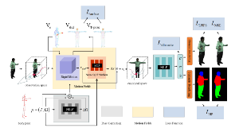
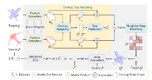
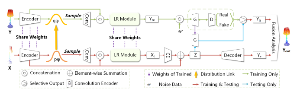
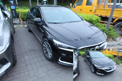
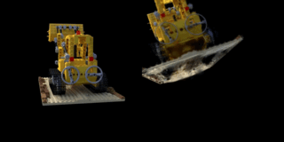

<!-- Current
===

*I am looking for a Ph.D. position in machine learning.* -->

Short Bio
===

I am **Jie Zhang (张杰)**, a third-year master's student at the [School of Software Engineering](http://se.xjtu.edu.cn/), [Xi'an Jiaotong University (XJTU)](http://www.xjtu.edu.cn/), majoring in Software Engineering. 

My primary research interests are 3D computer vision and human-centric computer vision.

Education
===
* Sept. 2021 --- June 2024: M.S. in Software Engineering, School of Software Engineering, Xi'an Jiaotong University
* Sept. 2017 --- June 2021: B.S. in Information and Computational Science, School of Mathematics and Physics, Chengdu University of Technology

Honors and Awards
===
* National Scholarship     2020

---

Publications
===

## Recent Preprints

* Semantic-Human: Neural Rendering of Humans from Monocular Video with Human Parsing [[PDF]](https://arxiv.org/pdf/2308.09894.pdf) [[Code]](https://arxiv.org/pdf/2308.09894.pdf)
  * **Jie Zhang**, Pengcheng Shi, Zaiwang Gu, Yiyang Zhou, Zhi Wang
  * 

* Overlap Bias Matching is Necessary for Point Cloud Registration [[PDF]](https://arxiv.org/abs/2308.09364) [[Code]](https://arxiv.org/abs/2308.09364)
  * Pengcheng Shi, **Jie Zhang**, Haozhe Cheng, Junyang Wang, Yiyang Zhou, Chenlin Zhao, Jihua Zhu
  * 

<!-- * DualGenerator: Information Interaction-based Generative Network for Point Cloud Completion [[PDF]](https://arxiv.org/pdf/2305.09132.pdf) [[Code]](https://arxiv.org/pdf/2305.09132.pdf)
  * Pengcheng Shi, Haozhe Cheng, Xu Han, Yiyang Zhou, **Jie Zhang**, Jihua Zhu
  *  -->

Research Experience
===

## In progress

* 3D Gaussian Splatting for Radiance Field Rendering from Blurred Images 
  * **Jie Zhang**
  * 

* Inverting Neural Radiance Fields for Pose Estimation Insensitive to Initial Conditions
  * **Jie Zhang**
  * 

## Done

* Preparing to update.

<!-- * DualGenerator: Information Interaction-based Generative Network for Point Cloud Completion [[PDF]](https://arxiv.org/pdf/2305.09132.pdf) [[Code]](https://arxiv.org/pdf/2305.09132.pdf)
  * Pengcheng Shi, Haozhe Cheng, Xu Han, Yiyang Zhou, **Jie Zhang**, Jihua Zhu
  *  -->

